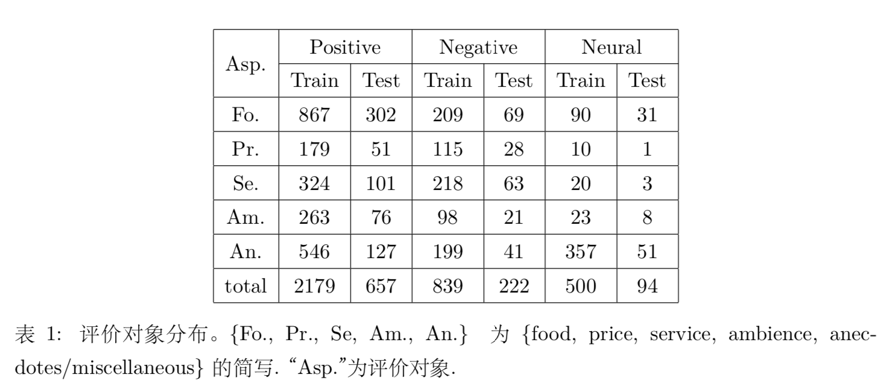
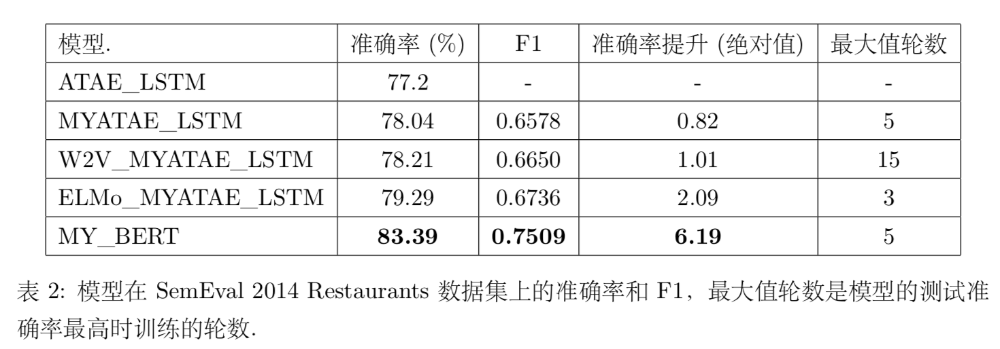

情感分析又称为意见挖掘，是自然语言处理领域中一项基础且重要的任务。细粒度的情感分析，能够从文本中挖掘出更加深层次的信息，在电商，团购，电影等领域具有较大的应用价值，因此最近受到了广泛的关注。对于一 个句子，比如”我喜欢这家店的菜品，但是服务有点差”，传统的情感分析只为其分配一个情感值(正面，中性，负面等)，而细粒度的情感分析能够提取出句子中的评价对象，并判断用户对其的情感，分析结果为(菜，正面)，(服 务，负面)。      

在 SemEval 2014 中的 Restaurants数据集上，首先复现了细粒度情感分析模型 ATAE_LSTM，准确率较原论文有 0.82% 的提升。然后采用特征集成的方式，对比分析了 GloVe、Word2Vec 和 ELMo 三种预训练技术对模型的提升效果。最后采用 BERT 加 fine- tune 的方式获得了较好的模型性能。   

## 数据集


## 运行环境
conda Python 3.7.3  
PyTorch 1.1.0  
GTX 1080Ti

## 预训练模型
1. Word2Vec  
GoogleNews-vectors-negative300.txt  
https://drive.google.com/file/d/0B7XkCwpI5KDYNlNUTTlSS21pQmM/edit?usp=sharing  
提取词向量：  
```
python create_embedding.py --ptype=word2vec \
        --pretrain_path ./pretrain/GoogleNews-vectors-negative300.txt \
        --save_path ./pretrain/sn.word2vec.300d.txt
```

2. glove  
glove.840B.300d.txt  
https://nlp.stanford.edu/projects/glove/   
提取词向量： 
```
python create_embedding.py --ptype=glove \
        --pretrain_path ./pretrain/glove.840B.300d.txt \
        --save_path ./pretrain/sn.glove.300d.txt
```

3. [elmo](https://allennlp.org/elmo)  
weigths  
https://s3-us-west-2.amazonaws.com/allennlp/models/elmo/2x4096_512_2048cnn_2xhighway_5.5B/elmo_2x4096_512_2048cnn_2xhighway_5.5B_weights.hdf5
options  
https://s3-us-west-2.amazonaws.com/allennlp/models/elmo/2x4096_512_2048cnn_2xhighway_5.5B/elmo_2x4096_512_2048cnn_2xhighway_5.5B_options.json  

4. bert  
https://github.com/huggingface/pytorch-pretrained-BERT
bert-base-uncased: 12-layer, 768-hidden, 12-heads, 110M parameters


## 训练模型
### train word2vec   
```
python main.py --train --pretrain_type word2vec \
--pretrain_path ./pretrain/sn.word2vec.300d.txt \
--vocab_path ./data/vocab/word2vec.vocab.data \
--model_name atae_lstm \
--test_step 10 \  # 每训练10步做一次测试
--lr 0.001 \
--save_dir w2c_stat_dict \
--max_epoch=20
```

### train glove   
```
python main.py --train --pretrain_type glove \
--pretrain_path ./pretrain/sn.glove.300d.txt \
--vocab_path ./data/vocab/glove.vocab.data \
--model_name atae_lstm \
--test_step 10 \
--save_dir glove_stat_dict \
--max_epoch=20 \
--lr 0.001
```

### train elmo
```
python train_elmo.py --train --lr 0.0005 --max_epoch=20 --test_step=100 --save_dir elmo_stat_dict
```

### train bert
```
python train_bert.py --do_train --output_dir bert_models/
```

## 模型效果


## 参考文献
* Attention-based LSTM for Aspect-level Sentiment Classification
* Bert: Pre-training of deep bidirectional transformers for language understanding
* Efficient estimation of word representations in vector space
* Distributed representations of words and phrases and their compositionality
* Glove: Global vectors for word representation
* Deep con- textualized word representations